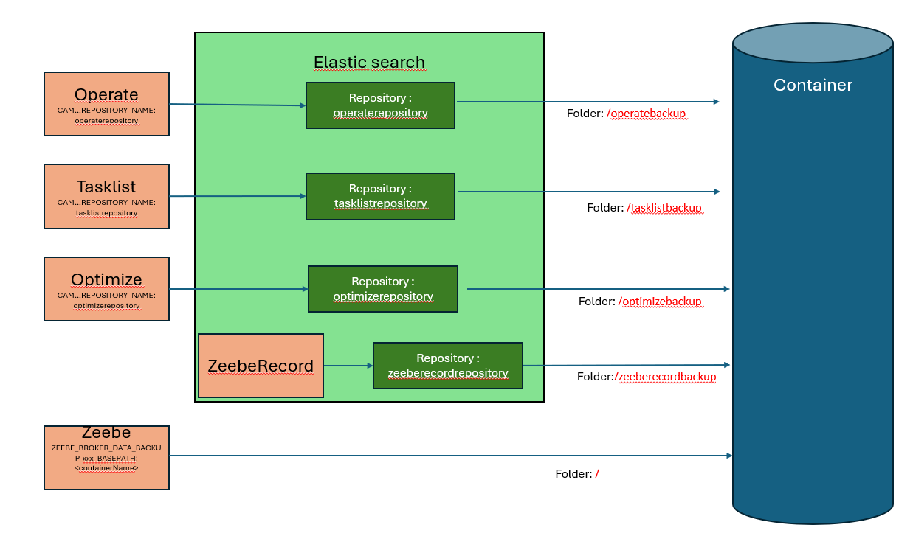
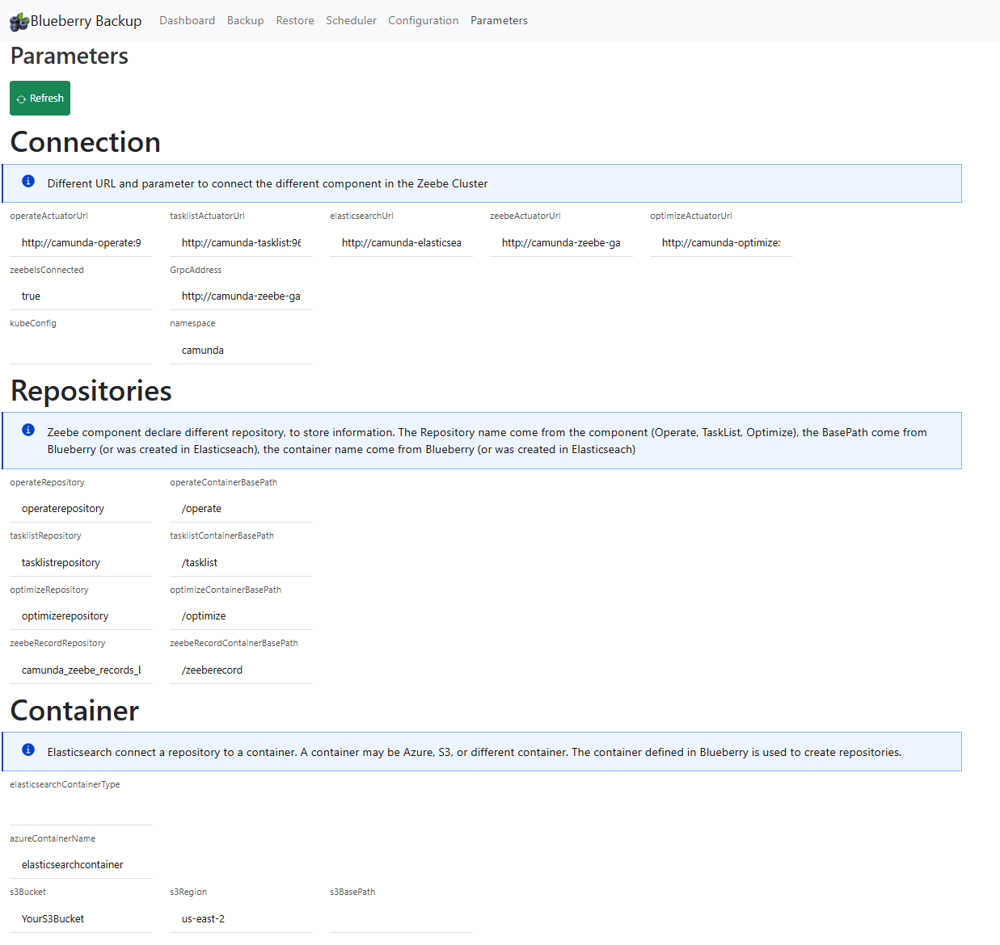

# C8-backup-toolkit
Documentation to configure the backup using S3, Azure, Minio 

This project contains two aspects
* a serie of documentation, to configure the Camunda cluster to be able to run the backup
* the Blueberry application, which check the configuration, can create it, and have an UI to start a backup, get the list of backups and execute a restore


# Documentation

## Preparation : Connect the cluster to an external storage
The C8 server will be connector to a storage to save the backup file.
The storage maybe on Azure, S3, Google, Minio.

The configuration is the following:
* The container (S3, Azure, AWS) is created, and accessible.
* Different repositories are created in Elastic Search (Operate, Tasklist, Optimize, ZeebeRecord)
* The ElasticSearch's repositories are referenced in each component (Operate, Tasklist, Operate, Zeebe)
* Zeebe referenced a container


Check the procedure step by step, according the storage


The procedure to connect on each storage are 
* [Azure](doc/storage/azure/README.md)
* [AWS S3](doc/storage/AWS-S3/README.md)
* [Google](doc/storage/GCP/README.md)
* [Minio](doc/storage/minio/README.md)


## Run a backup
The documentation on the backup is
https://docs.camunda.io/docs/8.5/self-managed/operational-guides/backup-restore/backup-and-restore/

Check the [Backup procedure](doc/backup/README.md)


## Run a restore

The restore is complex, because it's not only based on REST API. Zeebe has a specific tool to restore the data.
Check the [Restoration procedure](doc/restore/README.md)

# Blueberry application

The Blueberry application is available under an image, and can be deployed via Kubernetes.
A kubernetes file is accessible on the k8 folder

Run this command
```shell
cd k8s
kubectl create -f blueberry.yaml
```

to stop it

```shell
cd k8s
kubectl delete -f blueberry.yaml
```


The application is accessible under the port 9082. A simple way consist of "port-forward" the port to your PC

```shell
kubectl port-forward svc/blueberry-service 9082:9082 -n camunda
```

The application is accessible under localhost:9082

## Blueberry user interface 
 
### Dashboard page
The dashboard give you a main overview on the backup.


### Backup page

The backup home page list all existing backup, and start a new backup.

To start a new backup, click on "start backup". Blueberry calculate the next ID available and start it.
If the backup must be started using an explicit backup, then give the ID and start it.


### Restore page

In development

### Scheduler page

In development

### Configuration page
 The configuration page check if the configuration is correct: does all parameters are correctly set component per component?

Does all repository are created on Elastic search? 

If some configuration are missing, the page will detect it and notify you. Using the "Configure" button, some missing part can be created. For example, repository in Elastic search can be created if Blueberry know all the information.

See the coonfiguration section.


### Parameters page

The page show the different parameters the application used. Check if all of your expected values are correctly available.



## Configuration

The configuration is available in the application.yaml, and thanks to SpringBoot, it can be overrided as environment variable


| Parameter                                                                | Description                                                                   | Default value                      |
|--------------------------------------------------------------------------|-------------------------------------------------------------------------------|------------------------------------|
| blueberry.optimizeActuatorUrl                                            | Url to access Optimize                                                        | http://camunda-optimize:9600       |
| blueberry.operateActuatorUrl                                             | Url to access Operate                                                         | http://camunda-operate:9600        |    
| blueberry.tasklistActuatorUrl                                            | Url to access tasklist                                                        | http://camunda-tasklist:9600       |   
| blueberry.zeebeActuatorUrl                                               | Url to access Zeebe                                                           | http://camunda-zeebe-gateway:9600  | 
| blueberry.elasticsearchurl                                               | Url to access Elasticsearch                                                   | http://camunda-elasticsearch:9200  |
| ** This information are temporary. They must come from the pod itself ** |                                                                               |                                    | 
| blueberry.operateRepository                                              | Operate define a repository name, copy it here                                |                                    |
| blueberry.tasklistRepository                                             | Tasklist define a repository name, copy it here                               |                                    |
| blueberry.optimizeRepository                                             | Optimize define a repository name, copy it here                               |                                    |
| blueberry.zeebeRepository                                                | Zeebe define a repository name, copy it here                                  |                                    | 
|                                                                          |                                                                               |                                    | 
| blueberry.elasticsearch.operateContainerBasePath                         | In the container, folder to save the backup information                       | /operate                           |                           
| blueberry.elasticsearch.tasklistContainerBasePath                        | In the container, folder to save the backup information                       | /tasklist                          |
| blueberry.elasticsearch.optimizeContainerBasePath                        | In the container, folder to save the backup information                       | /optimize                          |
| blueberry.elasticsearch.zeebeRecordContainerBasePath                     | In the container, folder to save the backup information                       | /zeeberecord                       |
| blueberry.elasticsearch.zeebeRecordRepository                            | ZeebeRecord need a backup. Here is the name of the backup to be created       | camunda_zeebe_records_backup       |
| blueberry.elasticsearch.zeebeRecordBasePath                              | In the container, folder to save the backup information                       | zeeberecordbackup                  |
| blueberry.container.containerType                                        | Define the container used by Zeebe and by ElasticSearch. Value: "azure", "s3" | azure                              |
| blueberry.container.azure.containerName                                  | If the type is azure, name of the container                                   | "YourAzureContainerName"           |
| blueberry.container.s3.bucket                                            | If the type is S3, name of the bucket                                         | "YourS3Bucket"                     |
| blueberry.container.s3.region                                            | if the type is S3, region of the bucket                                       | "us-east-2"                        |


# Topics

Check the [Todo.md](Todo.md) file
Check the [Developement page](doc/dev/Development)