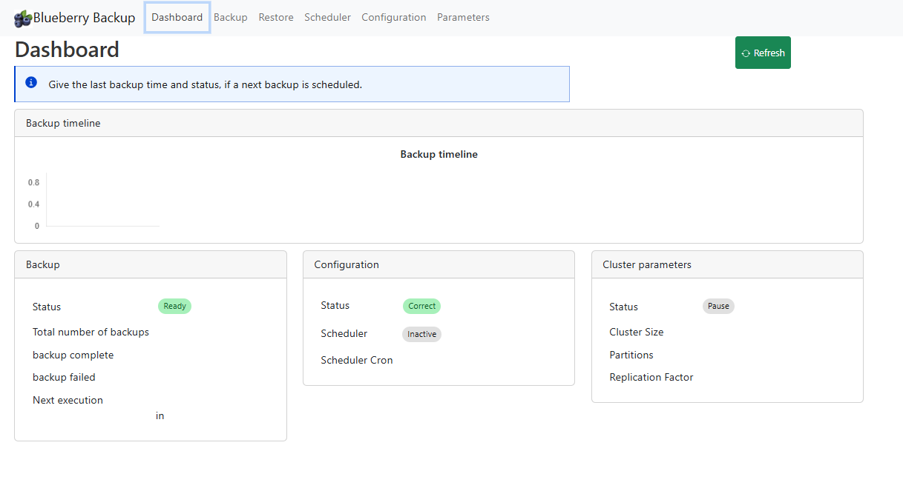

# C8-backup-toolkit
Documentation to configure the backup using S3, Azure, Minio 

This project contains two aspects
* a series of documentation, to configure the Camunda cluster to be able to run the backup
* the Blueberry application, which checks the configuration, can create it, and have an UI to start a backup, get the list of backups and execute a restore

# Documentation

## Preparation: Connect the cluster to an external storage
The C8 server will be connector to a storage to save the backup file.
The storage maybe on Azure, S3, Google, Minio.

The configuration is the following:
* The container (S3, Azure, AWS) is created, and accessible.
* Different repositories are created in ElasticSearch (Operate, Tasklist, Optimize, ZeebeRecord)
* The ElasticSearch's repositories are referenced in each component (Operate, Tasklist, Operate, Zeebe)
* Zeebe referenced a container

Check the procedure step by step, according the storage

The procedure to connect each storage are 
* [Azure](doc/storage/azure/README.md)
* [AWS S3](doc/storage/AWS-S3/README.md)
* [Google](doc/storage/GCP/README.md)
* [Minio](doc/storage/minio/README.md)

## Run a backup
The documentation on the backup is
https://docs.camunda.io/docs/8.5/self-managed/operational-guides/backup-restore/backup-and-restore/

Check the [Backup procedure](doc/backup/README.md)

## Run a restore

The restore is complex, because it's not only based on REST API. Zeebe has a specific tool to restore the data.
Check the [Restoration procedure](doc/restore/README.md)

# Blueberry application

The blueberry application is a UI application which 
* Check the backup configuration, and create the missing piece (create repository in ElasticSearch)
* Give the list of backups, with their status
* Create a backup, automate each step
* Execute a restore, automate each step

Check [Blueberry application](doc/blueberry/README.md)
