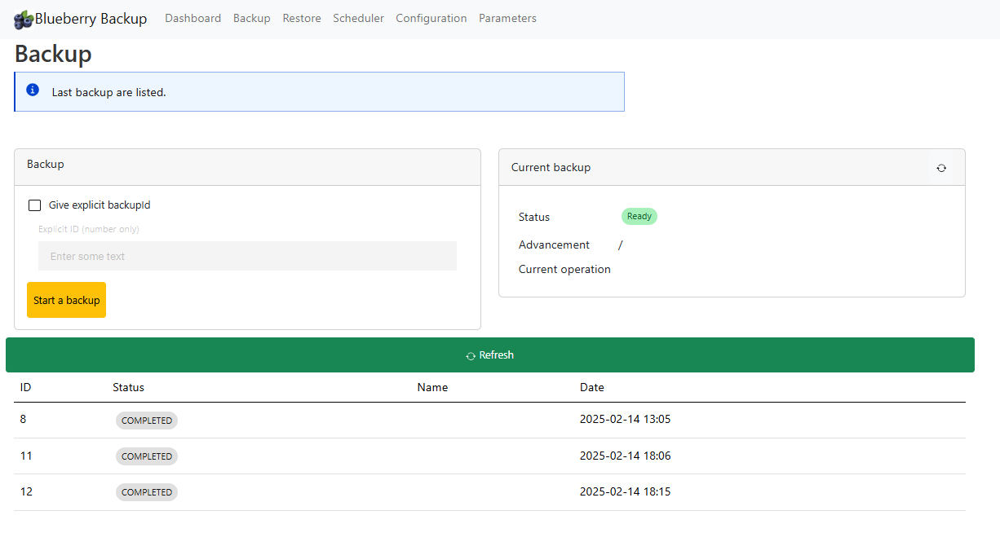
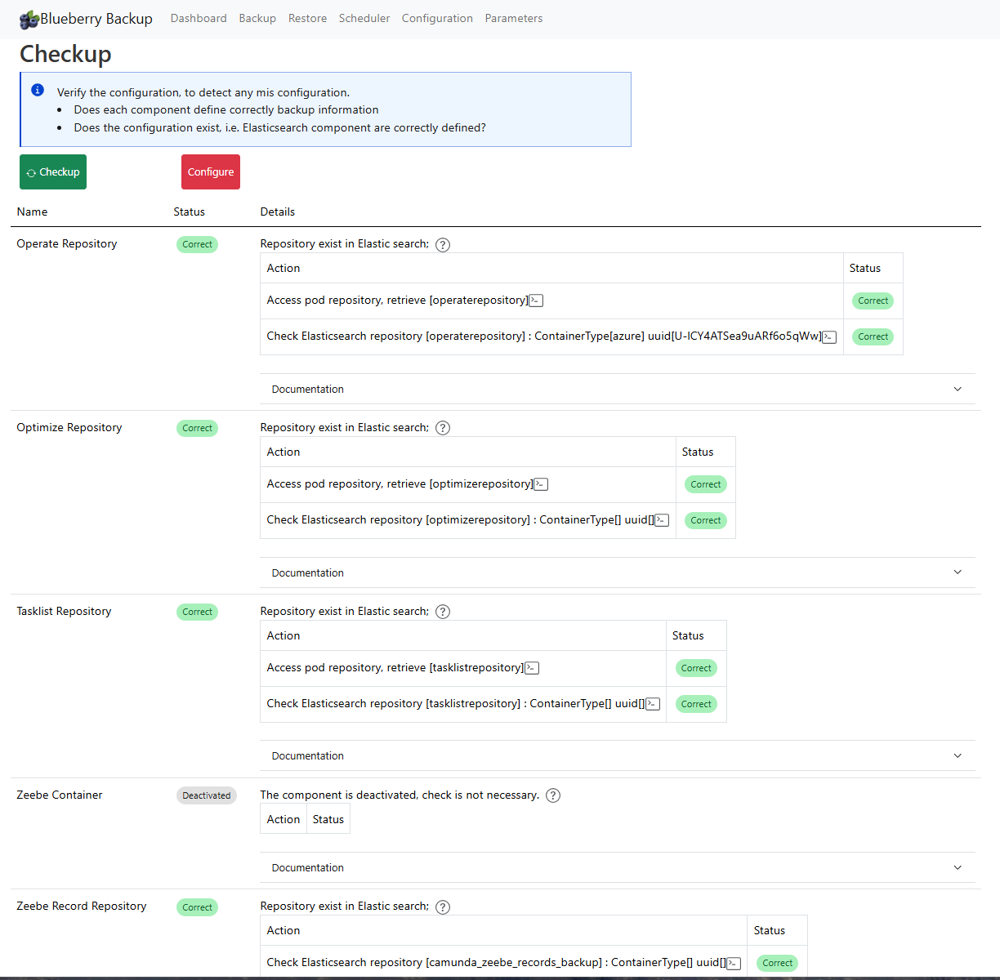

# Blueberry application

The Blueberry application is available under an image, and can be deployed via Kubernetes.
A kubernetes file is accessible into the k8 folder

Run this command
```shell
cd k8s
kubectl create -f blueberry.yaml
```

to stop it

```shell
cd k8s
kubectl delete -f blueberry.yaml
```


The application is accessible under the port 9082. A simple way consist of "port-forward" the port to your PC

```shell
kubectl port-forward svc/blueberry-service 9082:9082 -n camunda
```

The application is accessible under localhost:9082

## Blueberry user interface

### Dashboard page
The dashboard gives you a main overview on the backup.


### Backup page

The Backup home page displays all existing backups and allows you to start a new one.

To initiate a new backup, click "Start Backup." Blueberry will automatically calculate the next available backup ID and begin the process.

> This URL can be used in a Cron URL to start a backup at a frequency
 

If you need to start a backup with a specific ID, simply enter the desired ID and then start the backup manually.




### Restore page

In development

### Scheduler page

In development

### Configuration page
The configuration page checks if the configuration is correct: do all parameters correctly set component per component?

Do all repositories be created on Elastic search?

If some configuration is missing, the page will detect it and notify you. Using the "Configure" button, some missing part can be created. For example, repository in Elastic search can be created if Blueberry know all the information.

See the configuration section.




## Configuration


Blueberry needs to access the repository name used by Operate, TaskList, Zeebe to check the configuration. 
For example:
````yaml
operate:
  env:
    - name: CAMUNDA_OPERATE_BACKUP_REPOSITORY_NAME
      value: "operaterepository"
      
tasklist:
  env:
    - name: CAMUNDA_TASKLIST_BACKUP_REPOSITORY_NAME
      value: "tasklistrepository"

zeebe:
  env:
    - name: ZEEBE_BROKER_DATA_BACKUP_GCS_BUCKETNAME
      value: "pym-pc8backup-20250411"
    - name: ZEEBE_BROKER_DATA_BACKUP_GCS_BASEPATH
      value: "zeebecontainer"
    - name: ZEEBE_BROKER_DATA_BACKUP_STORE
      value: "GCS"
````


to check the configuration or create repositories in ElasticSearch.

> Blueberry use first to access the actuator method (see below). If this is not accessible, it get values from the configuration

**Explicit definition in the application**

The first option is to provide this information in the application.yaml

```yaml
blueberry:
  operateRepository: operaterepository
  tasklistRepository: tasklistrepository
  optimizeRepository : optimizerepository
  zeebeRepository: zeeberecordrepository
```
> ATTENTION: these values must match exactly the same name


It is possible to override it on Kubernetes via some environment variable.

**Actuator environment**

Blueberry tries to access the actuator environment for each application. 
If this operation failed, it will use the information defined in the configuration.

The actuator access is not open by default by the Camunda application. 
It may contain passwords, so It is not recommended to open it permanently.

it can be opened only to configure backup, i.e. when you need to click on the `Check` or the `Configure` button, 
one time in the life of the system.


Blueberry calls `/actuator/env` on each application.

This is possible via adding variable `management.endpoints.web.exposure.include`
and the variable `management.endpoint.env.show.values` to `ALWAYS`.


````yaml
operate:
  env:
    - name: CAMUNDA_OPERATE_BACKUP_REPOSITORY_NAME
      value: "operaterepository"
    - name: management.endpoints.web.exposure.include
      value: health, prometheus, loggers, usage-metrics, backup, env
    - name: management.endpoint.env.show.values
      value: ALWAYS
      
tasklist:
  env:
    - name: CAMUNDA_TASKLIST_BACKUP_REPOSITORY_NAME
      value: "tasklistrepository"
    - name: management.endpoints.web.exposure.include
      value: health, prometheus, loggers, usage-metrics, backup, env
    - name: management.endpoint.env.show.values
      value: ALWAYS

zeebe:
  env:
    - name: ZEEBE_BROKER_DATA_BACKUP_GCS_BUCKETNAME
      value: "pym-pc8backup-20250411"
    - name: ZEEBE_BROKER_DATA_BACKUP_GCS_BASEPATH
      value: "zeebecontainer"
    - name: ZEEBE_BROKER_DATA_BACKUP_STORE
      value: "GCS"
    - name: management.endpoints.web.exposure.include
      value: health, prometheus, loggers, usage-metrics, backup, env
    - name: management.endpoint.env.show.values
      value: ALWAYS
````

> ATTENTION: opening this feature is considered as a security breach. You can open this only for the configuration step. When the configuration is done (Blueberry creates all repository in ElasticSearch), you can remove this entry

The default value contains already some entry, so redefine it implies to add all the default values. They are accessible here:
https://docs.camunda.io/docs/self-managed/operate-deployment/operate-configuration/#monitoring-operate


### Parameters page

The page shows the different parameters the application used. Check if all of your expected values are correctly available.


The configuration is available in the application.yaml, and thanks to SpringBoot, it can be overrided with environment variable


| Parameter                                                                | Description                                                                   | Default value                      |
|--------------------------------------------------------------------------|-------------------------------------------------------------------------------|------------------------------------|
| blueberry.optimizeActuatorUrl                                            | Url to access Optimize                                                        | http://camunda-optimize:9600       |
| blueberry.operateActuatorUrl                                             | Url to access Operate                                                         | http://camunda-operate:9600        |    
| blueberry.tasklistActuatorUrl                                            | Url to access tasklist                                                        | http://camunda-tasklist:9600       |   
| blueberry.zeebeActuatorUrl                                               | Url to access Zeebe                                                           | http://camunda-zeebe-gateway:9600  | 
| blueberry.elasticsearchurl                                               | Url to access Elasticsearch                                                   | http://camunda-elasticsearch:9200  |
| ** This information are temporary. They must come from the pod itself ** |                                                                               |                                    | 
| blueberry.operateRepository                                              | Operate define a repository name, copy it here                                |                                    |
| blueberry.tasklistRepository                                             | Tasklist define a repository name, copy it here                               |                                    |
| blueberry.optimizeRepository                                             | Optimize define a repository name, copy it here                               |                                    |
| blueberry.zeebeRepository                                                | Zeebe define a repository name, copy it here                                  |                                    | 
|                                                                          |                                                                               |                                    | 
| blueberry.elasticsearch.operateContainerBasePath                         | In the container, folder to save the backup information                       | /operate                           |                           
| blueberry.elasticsearch.tasklistContainerBasePath                        | In the container, folder to save the backup information                       | /tasklist                          |
| blueberry.elasticsearch.optimizeContainerBasePath                        | In the container, folder to save the backup information                       | /optimize                          |
| blueberry.elasticsearch.zeebeRecordContainerBasePath                     | In the container, folder to save the backup information                       | /zeeberecord                       |
| blueberry.elasticsearch.zeebeRecordRepository                            | ZeebeRecord need a backup. Here is the name of the backup to be created       | camunda_zeebe_records_backup       |
| blueberry.elasticsearch.zeebeRecordBasePath                              | In the container, folder to save the backup information                       | zeeberecordbackup                  |
| blueberry.container.containerType                                        | Define the container used by Zeebe and by ElasticSearch. Value: "azure", "s3" | azure                              |
| blueberry.container.azure.containerName                                  | If the type is azure, name of the container                                   | "YourAzureContainerName"           |
| blueberry.container.s3.bucket                                            | If the type is S3, name of the bucket                                         | "YourS3Bucket"                     |
| blueberry.container.s3.region                                            | if the type is S3, region of the bucket                                       | "us-east-2"                        |


# Topics

Check the [Todo.md](Todo.md) file
Check the [Developement page](doc/dev/Development)


