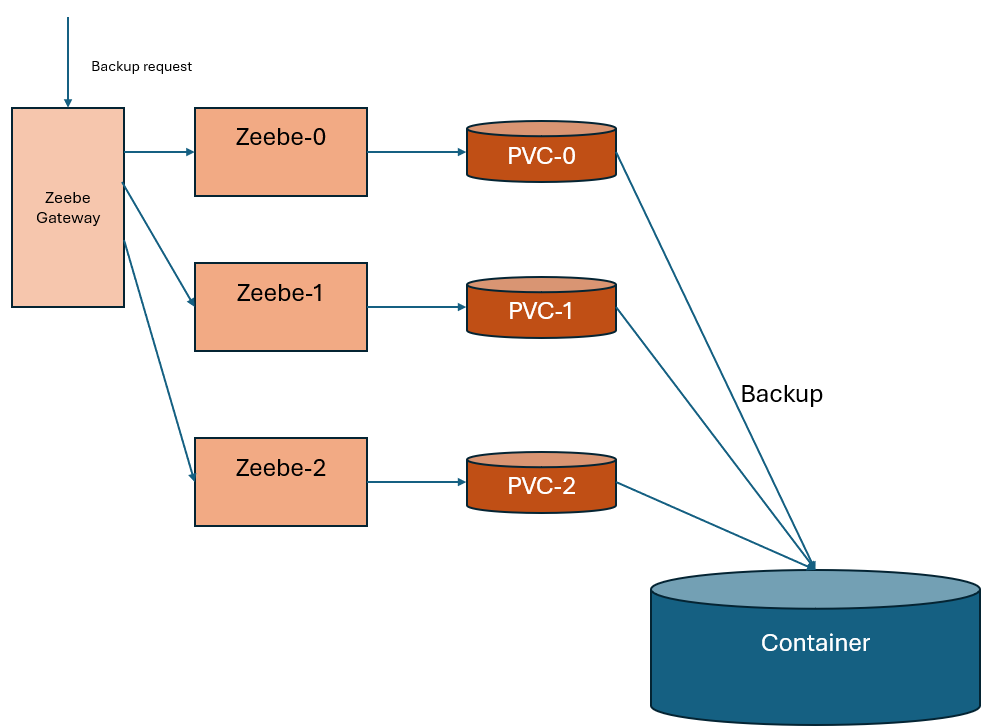
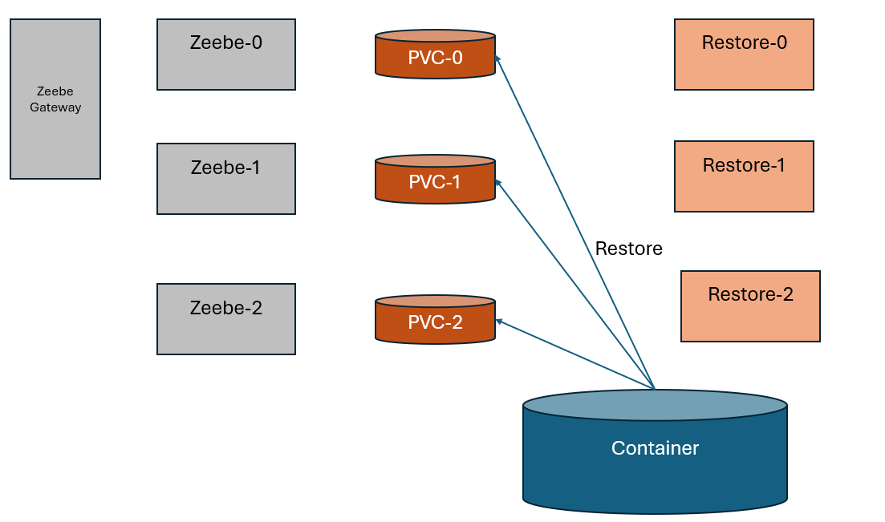

# Restore

This procedure explains the restoration procedure for Zeebe.

https://docs.camunda.io/docs/8.5/self-managed/operational-guides/backup-restore/restore/

The method to restore Operate, Tasklist and Optimize are based on restoring Elastic Search.

This documentation focuses on how to restore Zeebe.

There are two methods. Using Camunda 8.5 or after should use the first method. Older version can use the `Prepare kubernetes files` method.


# Run the restore via an init container

According to the documentation https://docs.camunda.io/docs/8.5/self-managed/operational-guides/backup-restore/restore/, prepare the following init container

Note that the init container purges the path `/usr/local/zeebe/data` before restoring.

The restore need to find
* the ZEEBE_BROKER_CLUSTER_NODEID. It is calculated from the pod name in the Statefulset
* the cluster size: PARTITIONSCOUNT, CLUSTERSIZE, REPLICATIONFACTOR
* the information to access the storage.


```yaml
zeebe:
  initContainers:
    - name: zeebe-restore
      image: camunda/zeebe
      command: ["/bin/bash"]
      args:
        - -c
        - |
          if [ ${ZEEBE_RESTORE} = "true" ];
          then
            env;
            export ZEEBE_BROKER_CLUSTER_NODEID=${ZEEBE_BROKER_CLUSTER_NODEID:-${K8S_NAME##*-}};
            echo ClusterId is $ZEEBE_BROKER_CLUSTER_NODEID;
            rm -rf /usr/local/zeebe/data/*
            rm -rf /usr/local/zeebe/data/lost+found;
            echo "After cleanup"          
            exec /usr/local/zeebe/bin/restore --backupId=$BACKUP_ID;
          fi
      env:
        - name: K8S_NAME
          valueFrom:
            fieldRef:
              fieldPath: metadata.name
        - name: ZEEBE_BROKER_CLUSTER_PARTITIONSCOUNT
          value: "3"
        - name: ZEEBE_BROKER_CLUSTER_CLUSTERSIZE
          value: "3"
        - name: ZEEBE_BROKER_CLUSTER_REPLICATIONFACTOR
          value: "3"
          
        - name: ZEEBE_BROKER_DATA_BACKUP_STORE
          value: "..."
        - name: $BACKUP_ID
          value: "..."
        - name: ZEEBE_RESTORE
          value: "false"
      volumeMounts:
        - name: data
          mountPath: /usr/local/zeebe/data

```
.
To run a restore, change the value.yaml to turn `ZEEBE_RESTORE` to true and run a helm ugrade.
Do not forget to turn off `ZEEBE_RESTORE` to false.


# Prepare kubernetes files

This method is the old one, before the initContainer method.
Thanks to the project https://github.com/ManuelDittmar/backup-restore-demo.

The documentation is accessible https://docs.camunda.io/docs/self-managed/operational-guides/backup-restore/backup-and-restore/#restore


## Preparation

This preparation has to be done one time. It consists of create one restore file per ClusterSize.
If you have clusterSize = 3, tou have 3 pods, then 3 PVC to restore.

When a HTTP request is sent via a RESTAPI, the gateway sends the order to each pod. Each pod backup (copy) the file to the container.



The restoration works differently. A software `/bin/restore` is provided in each pod. It has to be called.

* Zeebe pods must be stopped, 
* One restore execution must be performed per PVC. This is not an HTTP request, but a new software to execute, pod per pod.



> Attention: if you change the cluster configuration, adding one more pod for example, it is important to use the same parameter as you use during the backup. Let say that you add a pod on, may 10, but the backup you want to restore was created on May 5, with cluster size=3. 
> This is crucial to use the 3 YAML files restore.
 


### Prep.1 Creates files from the template

Let say you have a cluster ClusterSize=3.

**You must create 3 files from the template** `zeebe-restore-job-0.yaml`, `zeebe-restore-job-1.yaml`, `zeebe-restore-job-2.yaml`


### Prep.2 Replaces the image

Check the image, and set the exact same image where the backup was performed:

```
        # TODO Adjust based on your Zeebe version
        image: camunda/zeebe:1.0.0
```


### Prep.3 In each file, modify the  `ZEEBE_BROKER_CLUSTER_NODEID`

< ClusterSize > files are created, named 0 to (ClusterSize-1). In each file, a unique number must be set, started at 0.

```
  - name: ZEEBE_BROKER_CLUSTER_NODEID
    value: "TODO: VALUE-FROM-0-TO-(ClusterSize-1)"
```

For example,

```
  - name: ZEEBE_BROKER_CLUSTER_NODEID
    value: "0"
```

### Prep.4 Partitions, ClusterSize, Replication factor

Replace all others TODO with the correct information.
Remember: this information must match the backup, not the current cluster if the configuration change between the backup and the current cluster.

```
        - name: ZEEBE_BROKER_CLUSTER_PARTITIONSCOUNT
          value: "TODO: NUMBER-OF-PARTITIONS"
        - name: ZEEBE_BROKER_CLUSTER_CLUSTERSIZE
          value: "TODO: ClusterSize"
        - name: ZEEBE_BROKER_CLUSTER_REPLICATIONFACTOR
          value: "TODO: Replication Factor"
```

### Prep.5 Check the PVC name

The PV must be claimed according to the NODEID in **EACH FILE**

```
volumes:
  - name: data
    persistentVolumeClaim:
    # TODO VALUE-FROM-0-(ClusterSize-1) - check the PVC (claim name) name in your cluster
    claimName: data-camunda-zeebe-VALUE-FROM-0-TO-(ClusterSize-1)
```

for example, 

```
volumes:
  - name: data
    persistentVolumeClaim:
    # TODO VALUE-FROM-0-(ClusterSize-1) - check the PVC (claim name) name in your cluster
    claimName: data-camunda-zeebe-0

```

> Attention: the claimName may be different on your system, because the claim name contains the domain name. Check the claim via a kubetcl get pods on Zeebe

### Prep.6  Storage

Check the Zeebe configuration, and update it.

For example, for an Azure storage:
```
    - name: ZEEBE_BROKER_DATA_BACKUP_STORE
      value: "AZURE"
    - name: ZEEBE_BROKER_DATA_BACKUP_AZURE_CONNECTIONSTRING
      value: Defa.....net
    - name: ZEEBE_BROKER_DATA_BACKUP_AZURE_BASEPATH
      value: zeebecontainer
```

## Restore

### BackupID

In the configuration file, the backupID is retrieved from a secret. For example:
````
        - name: ZEEBE_RESTORE_FROM_BACKUP_ID
          valueFrom:
            secretKeyRef:
              name: backup-timeid
              key: backupTimeId
 ````

So, the first step consists of creating this secret and save the backupId to restore

1.1 Create the secret with the backupID

```shell
kubectl create secret generic backup-timeid --from-literal=backupTimeId=12
```


## Get the configuration

> Attention: what is important is the values when the backup was created. Assuming values does not change.

2.1 Run a get pods to inspect the current situation

```shell
kubectl get pods

NAME                                    READY   STATUS    RESTARTS   AGE
camunda-elasticsearch-master-0          1/1     Running   0          3m19s
camunda-elasticsearch-master-1          1/1     Running   0          3m19s
camunda-elasticsearch-master-2          1/1     Running   0          3m19s
camunda-operate-76bb6d896c-2zm7b        1/1     Running   0          3m20s
camunda-optimize-7f4cd5f9b6-vf7ms       1/1     Running   0          3m20s
camunda-tasklist-59474455b4-2fzfl       1/1     Running   0          3m20s
camunda-zeebe-0                         1/1     Running   0          3m19s
camunda-zeebe-1                         1/1     Running   0          3m19s
camunda-zeebe-2                         1/1     Running   0          3m19s
camunda-zeebe-gateway-d7c97f64c-wkdfq   1/1     Running   0          3m20s
```

And check how many instances are on each component.

| Component    | Number of instances |
|--------------|--------------------:| 
| zeebe        |                   3 |
| zeebeGateway |                   1 |
| Operate      |                   1 |
| TaskList     |                   1 |


2.2 Check if all repositories exist in Elasticsearch. This configuration must be executed if you start from an empty database.

```shell
curl -X GET "http://localhost:9200/_snapshot/_all?pretty"
```

### scale down components
The idea is to stop all components but keep the PCV.

3.1 Execute these commands:

```shell
kubectl scale sts/camunda-zeebe --replicas=0
kubectl scale deploy/camunda-zeebe-gateway --replicas=0
kubectl scale deploy/camunda-operate --replicas=0
kubectl scale deploy/camunda-tasklist --replicas=0
kubectl scale deploy/camunda-optimize --replicas=0
```

3.2 Only Elasticsearch is up and running now.

```shell
kubectl get pods

NAME                                    READY   STATUS    RESTARTS   AGE
camunda-elasticsearch-master-0          1/1     Running   0          3m19s
camunda-elasticsearch-master-1          1/1     Running   0          3m19s
camunda-elasticsearch-master-2          1/1     Running   0          3m19s
```


## Delete all indexes in Elastic search
When Operate, Tasklist, and Optimize start, they create indexes. It must be purged.

In the k8 folder, an `es-delete-all-indices.yaml` file is present. This Kubernetes file creates a pod that executes this deletion.

The script is present under `doc/restore/k8`, so if needed, do a `cd` in that folder.

4.1 Purge

```shell
kubectl apply -f k8/es-delete-all-indices.yaml
```
When the deletion is performed, the pod will stop and move to the state "Completed"

4.2 Wait for the status:

```shell
Kubernetes get pods
es-delete-all-indices-job-bs2h9   0/1     Completed   0          18s
```

4.3 Delete the deletion pod

```shell
kubectl delete -f es-delete-all-indices.yaml
```

4.4 Run the command to verify that all indexes are deleted

```shell
curl -X GET "http://localhost:9200/_cat/indices?v"
health status index uuid pri rep docs.count docs.deleted store.size pri.store.size dataset.size
```
The list must be empty.

## Restore Elasticsearch backup

5.1 Run the pod; the script is present in `doc/restore/k8`

```shell
kubectl apply -f es-snapshot-restore.yaml
```

5.2 Monitor the execution. At the end, the pod status changed to `Completed`.

```shell
kubernetes get pods
es-snapshot-restore-job-pdvzz   0/1     Completed   0          18s
```

5.3 Remove the restore pod

```shell
kubectl delete -f es-snapshot-restore.yaml
```

5.4 Check indexes are restored 

```shell
curl -X GET "http://localhost:9200/_cat/indices?v"
health status index                                     uuid                   pri rep docs.count docs.deleted store.size pri.store.size dataset.size
green  open   operate-message-8.5.0_                    kGn9TkwRRqGlRaoW1anvaQ   1   0          0            0       249b           249b         249b
green  open   operate-batch-operation-1.0.0_            QimDEIwKSwmUYqD8Bc1KRw   1   0          0            0       249b           249b         249b
green  open   operate-web-session-1.1.0_                CWDoCuBiTsO9i5xQwuduxg   1   0          0            0       249b           249b         249b
green  open   operate-flownode-instance-8.3.1_          gVKhEQLZR0WiXGfvQ5kIOw   1   0         12            0     23.6kb         23.6kb       23.6kb
green  open   operate-decision-8.3.0_                   VfEt4Nj5RnKSUtT08V-TFg   1   0          0            0       249b           249b         249b
green  open   operate-user-task-8.5.0_                  U_nEvmNSQauEmp915agkOQ   1   0          0            0       249b           249b         249b
green  open   operate-event-8.3.0_                      yZGw2XLERUSrw0wUsmof3Q   1   0         12            5     33.6kb         33.6kb       33.6kb
green  open   operate-job-8.6.0_                        A_OE0XWVQBKVHF2DjJtqXw   1   0          6            0     22.9kb         22.9kb       22.9kb
green  open   operate-variable-8.3.0_                   4xWHq0ZuQpS4Vi4atJ53jQ   1   0         28            0       23kb           23kb         23kb
green  open   operate-post-importer-queue-8.3.0_        1xWpxnqeQ16_Bx7SxK4H7w   1   0          0            0       249b           249b         249b
green  open   operate-list-view-8.3.0_                  F96hokUKTbG6NOzpWVsYtg   1   0         46            5    124.2kb        124.2kb      124.2kb
green  open   operate-decision-instance-8.3.0_          y4dEs61MSGqcPT8RKbMiOQ   1   0          0            0       249b           249b         249b
green  open   operate-migration-steps-repository-1.1.0_ fpLS4XtpQvuF9K2CmEPQYA   1   0         27            1     29.5kb         29.5kb       29.5kb
green  open   operate-user-1.2.0_                       YCSNPijSS5OQVhHTjaNKRQ   1   0          3            0      6.7kb          6.7kb        6.7kb
green  open   operate-sequence-flow-8.3.0_              WGxc-bbrQ8G-troFT0jEwA   1   0          6            0     13.6kb         13.6kb       13.6kb
green  open   operate-metric-8.3.0_                     G2oNlA6MQoK2DiZRZbhsyQ   1   0          6            0     11.7kb         11.7kb       11.7kb
green  open   operate-operation-8.4.1_                  AXbJWKmSTey0yfzHl_AanA   1   0          0            0       249b           249b         249b
green  open   operate-import-position-8.3.0_            9FgKNWwcQ6CleKdCQcSIeg   1   0         12            7     17.5kb         17.5kb       17.5kb
green  open   operate-incident-8.3.1_                   omR5v_KXRkGWagXYBKYkdw   1   0          0            0       249b           249b         249b
green  open   operate-decision-requirements-8.3.0_      21FcaK25TJuzpHrqk5aoNg   1   0          0            0       249b           249b         249b
green  open   operate-process-8.3.0_                    8hFENmo0TOCbtHWUweN-AA   1   0          2            2    181.2kb        181.2kb      181.2kb
```


> Note: in the yaml file, the list of repositories is given
> ```
> # Define the list of repository names
> repositories="operaterepository optimizebackup tasklistrepository zeeberecordrepository"
> ```
> This list may be adapted according to the repositories created in Elasticsearch. The current values are those created in the backup procedure.


### Restore Zeebe 

6.1 Run each kubernetes file created during the preparation, one by one


```shell
kubectl apply -f restore/zeebe-restore-job-XXXX.yaml
```

6.2 Check logs on each pod:

```
2025-02-15 02:19:22.364 [] [] [] INFO 
      io.camunda.zeebe.restore.RestoreManager - Successfully restored partition 2 from backup 12. Backup description: BackupDescriptorImpl[snapshotId=Optional[9-1-12-10-2], checkpointPosition=62, numberOfPartitions=3, brokerVersion=8.6.9]
2025-02-15 02:19:22.364 [] [] [] INFO
      io.camunda.zeebe.restore.RestoreManager - Successfully restored partition 3 from backup 12. Backup description: BackupDescriptorImpl[snapshotId=Optional[23-1-46-68-2], checkpointPosition=69, numberOfPartitions=3, brokerVersion=8.6.9]
2025-02-15 02:19:22.364 [] [] [] INFO
      io.camunda.zeebe.restore.RestoreManager - Successfully restored partition 1 from backup 12. Backup description: BackupDescriptorImpl[snapshotId=Optional[11-1-50-17-0], checkpointPosition=134, numberOfPartitions=3, brokerVersion=8.6.9]
2025-02-15 02:19:22.373 [] [main] [] INFO
      io.camunda.zeebe.restore.RestoreApp - Successfully restored broker from backup 12
Restoration complete.
```


### Scale back the application

7.1 Uses the value saved during the exploration to restart all components with the correct value.

```shell
kubectl scale sts/camunda-zeebe --replicas=3
kubectl rollout status sts/camunda-zeebe
kubectl scale deploy/camunda-zeebe-gateway --replicas=1
kubectl scale deploy/camunda-operate --replicas=1
kubectl scale deploy/camunda-tasklist --replicas=1
kubectl scale deploy/camunda-optimize --replicas=1
```

Check the system.