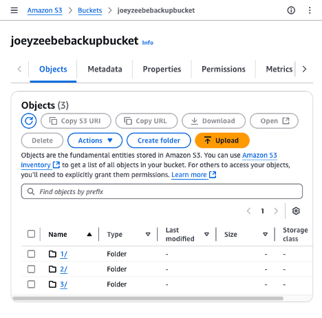
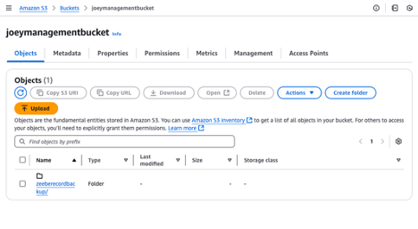
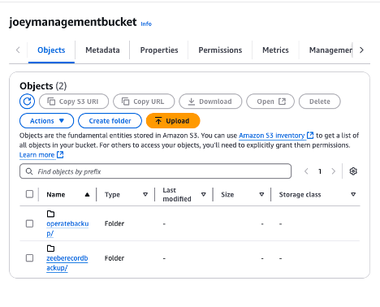

# Connection via the Account Name / key

# Zeebe

In the Helm chart , in the Zeebe section, add this information
```yaml
zeebe:
  env:
    - name: ZEEBE_BROKER_DATA_BACKUP_STORE
      value: "S3"
    - name: ZEEBE_BROKER_DATA_BACKUP_S3_BUCKETNAME
      value: "zeebebucket"  # Your S3 bucket name
    - name: ZEEBE_BROKER_DATA_BACKUP_S3_REGION
      value: "us-east-2"  # AWS region where your S3 bucket is located
````      
### Zeebe Broker Data Backup Configuration for S3

#### Environment Variables

| Variable                                      | Description |
|-----------------------------------------------|-------------|
| `ZEEBE_BROKER_DATA_BACKUP_STORE`             | Set this to `S3` to store backups in S3 buckets. |
| `ZEEBE_BROKER_DATA_BACKUP_S3_BUCKETNAME`     | The backup is stored in this bucket. The bucket must already exist. |
| `ZEEBE_BROKER_DATA_BACKUP_S3_BASEPATH`       | If the bucket is shared with other Zeebe clusters, a unique `basePath` must be configured. |
| `ZEEBE_BROKER_DATA_BACKUP_S3_ENDPOINT`       | If no endpoint is provided, it is determined based on the configured region. |
| `ZEEBE_BROKER_DATA_BACKUP_S3_REGION`         | If no region is provided, it is determined from the environment. |
| `ZEEBE_BROKER_DATA_BACKUP_S3_ACCESSKEY`      | If either `accessKey` or `secretKey` is not provided, the credentials are determined from the environment. |
| `ZEEBE_BROKER_DATA_BACKUP_S3_SECRETKEY`      | Specify the secret key. |

See the documentation https://docs.camunda.io/docs/self-managed/operational-guides/backup-restore/zeebe-backup-and-restore/#s3-backup-store

## Test

Run a backup on Zeebe directly. See the documentation
https://docs.camunda.io/docs/self-managed/zeebe-deployment/operations/management-api/

1. Port-forward the server
```shell
kubectl port-forward svc/camunda-zeebe-gateway 9600:9600 -n camunda
```
2. pause the exporting

```shell
curl -X POST "http://localhost:9600/actuator/exporting/pause"   -H 'Content-Type: application/json'    -d '{}'
```

3. Execute a backup

```shell
curl -X POST "http://localhost:9600/actuator/backups"  -H 'Content-Type: application/json'  -d "{\"backupId\": \"8\"}"
```
4. Monitor the backup
```shell
curl -s "http://localhost:9600/actuator/backups/8"
```

5. Resume Zeebe

```shell
curl -X POST "http://localhost:9600/actuator/exporting/resume"  -H 'Content-Type: application/json'    -d '{}'
```


Some files must be visible on the storage



# Elasticsearch

The configuration is
```yaml
initScripts:
  init-keystore.sh: |
    #!/bin/bash
    set -e
    echo "Adding AWS access keys to Elasticsearch keystore..."
    echo "$AWS_ACCESS_KEY_ID" | elasticsearch-keystore add -f -x s3.client.default.access_key
    echo "$AWS_SECRET_ACCESS_KEY" | elasticsearch-keystore add -f -x s3.client.default.secret_key
    echo "$AWS_REGION" | elasticsearch-keystore add -f -x s3.client.default.region
  extraVolumeMounts:
    - name: empty-dir
      mountPath: /bitnami/elasticsearch
      subPath: app-volume-dir
  extraConfig:
    s3.client.default.endpoint: "s3.amazonaws.com"
    s3.client.default.bucket: "elasticsearchbucket"  # Your S3 bucket name
  extraEnvVars:
    - name: AWS_ACCESS_KEY_ID
      value: <Your AWS ACCESS KEY>
    - name: AWS_SECRET_ACCESS_KEY
      value: <Your AWS SECRET KEY>
    - name: AWS_REGION
      value: us-east-2  # Your AWS region, change as needed
```      

By doing that, you connect Elastic search to AWS S3.

Reference a repository for **Operate**, **Tasklist**, and **Optimize**
```yaml
operate:
  enabled: true
  env:
    - name: CAMUNDA_OPERATE_BACKUP_REPOSITORY_NAME
      value: "operaterepository"
tasklist:
  enabled: true
  env:
    - name: CAMUNDA_TASKLIST_BACKUP_REPOSITORY_NAME
      value: "tasklistrepository"
optimize:
  enabled: true
  env:
    - name: CAMUNDA_OPTIMIZE_BACKUP_REPOSITORY_NAME 
      value: "optimizerepository"
```

Start the cluster.
Access Elasticsearch, via a `port-forward` for example

```shell
kubectl port-forward svc/camunda-elasticsearch 9200:9200 -n camunda
```

Create a repository `zeeberecordrepository` and register the AWS S3 bucket. it's possible to register a `base_path`, to save the content in a subfolder on the bucket 

```shell
curl -X PUT "http://localhost:9200/_snapshot/zeeberecordrepository" -H "Content-Type: application/json" \
-d '{
  "type": "s3",
  "settings": {
    "bucket": "elasticsearchbucket",
    "base_path": "zeeberecordbackup",
    "region": "us-east-2"
  }
}'
```


Create a repository `operaterepository`
```shell
curl -X PUT "http://localhost:9200/_snapshot/operaterepository" -H "Content-Type: application/json" \
-d '{
  "type": "s3",
  "settings": {
    "bucket": "elasticsearchbucket",
    "base_path": "operatebackup",
    "region": "us-east-2"
  }
}'
```

Create a repository `tasklistrepository`

```shell
curl -X PUT "http://localhost:9200/_snapshot/tasklistrepository" -H "Content-Type: application/json" \
-d '{
  "type": "s3",
  "settings": {
    "bucket": "elasticsearchbucket",
    "base_path": "tasklistbackup",
    "region": "us-east-2"
  }
}'
```

Create a repository `optimizerepository`

```shell
curl -X PUT "http://localhost:9200/_snapshot/optimizerepository" -H "Content-Type: application/json" \
-d '{
  "type": "s3",
  "settings": {
    "bucket": "elasticsearchbucket",
    "base_path": "optimizebackup",
    "region": "us-east-2"
  }
}'
```

Get all repositories, to verify the creation

```shell
curl -X GET "http://localhost:9200/_snapshot/_all?pretty"
```

##	Test the Zeebe Record backup
Run a backup on Zeebe Record

```shell
curl -X PUT http://localhost:9200/_snapshot/zeeberecordrepository/backup_1 -H 'Content-Type: application/json'   \
-d '{ "indices": "zeebe-record*", "feature_states": ["none"]}'
```

An answer {“accepted”:true}, and a folder is created on the bucket



** Restore**

1. check the existence of all zeebe-record indexes

```shell
curl -X GET http://localhost:9200/_cat/indices/zeebe-record*?v
```

2. Delete all indices

```shell
curl -X DELETE http://localhost:9200/zeebe-record*?
```

> ***Note***: the deletion may need to delete index per index

3. Restore

```shell
curl -X POST http://localhost:9200/_snapshot/zeeberecordrepository/backup_1/_restore -H "Content-Type: application/json" -d '{ "indices": "*", "ignore_unavailable": true, "include_global_state": true }'
```

## Test the backup on Operate

This backup is run on Operate. Operate will contact Elasticsearch to run the backup.

Port forward the port number 9600 on operate

```shell
kubectl port-forward svc/camunda-operate 9600:9600 -n camunda
```

> **Note** on 8.5, the port to run the backup is 80, not 9600.
 

1.	Backup Operate
 
Run the backup

```shell
curl -X POST http://localhost:9600/actuator/backups -H 'Content-Type: application/json' -d '{ "backupId": 6}'
```

2. Check the bucket



Get all snapshot on the repository

```shell
curl -X GET "http://localhost:9200/_snapshot/operaterepository/_all?pretty"
```

