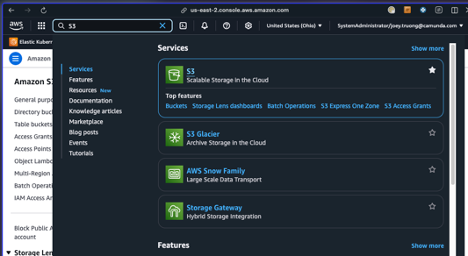

# Pre requisite

Connect to AWS and go to S3

Create an Amazon S3 bucket

Give your bucket a name like `joeyzeebebackupbucket`

Optional:
If you want to access your bucket publicly, uncheck `Block all public access`
### To access your `Access Key` or Create.
1. Go to IAM (Identity and Access Management). 
2. In the left sidebar, click `Users`
3. Select your `IAM user`
4. Go to the `Security credentials tab`
5. Scroll down to `Access keys`
6. Click Create `Access key`

Inside this account, you create bucket. Let’s create two Buckets
•	Bucket `elasticsearchbucket`
•	Bucket `zeebebucket`

The first bucket will contain all backup from elastic search (Zeebe record, operate, Tasklist, optimize)

> ***Note***: You don’t need to create two buckets; this is just to demonstrate the different links to each bucket. For your information, Zeebe saves snapshots at the root of the bucket, whereas Elasticsearch can save information in a subfolder in the bucket.

Vocabulary
* A **bucket** is like a disk. It contains folders and files
* A **repository** is a name in Elastic Search. A repository references a place to store data: it will reference a bucket and a base path in that bucket (for example, /operatebackup)
* A **snapshot** is one execution in the repository, and it save the current information to the repository. A repository contains multiple snapshot.

