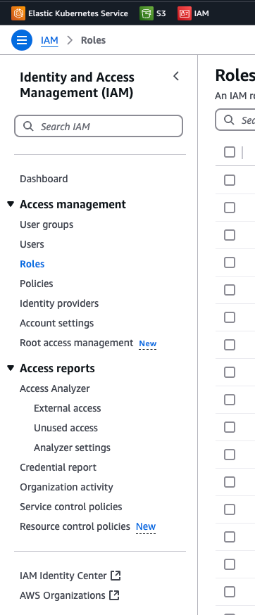
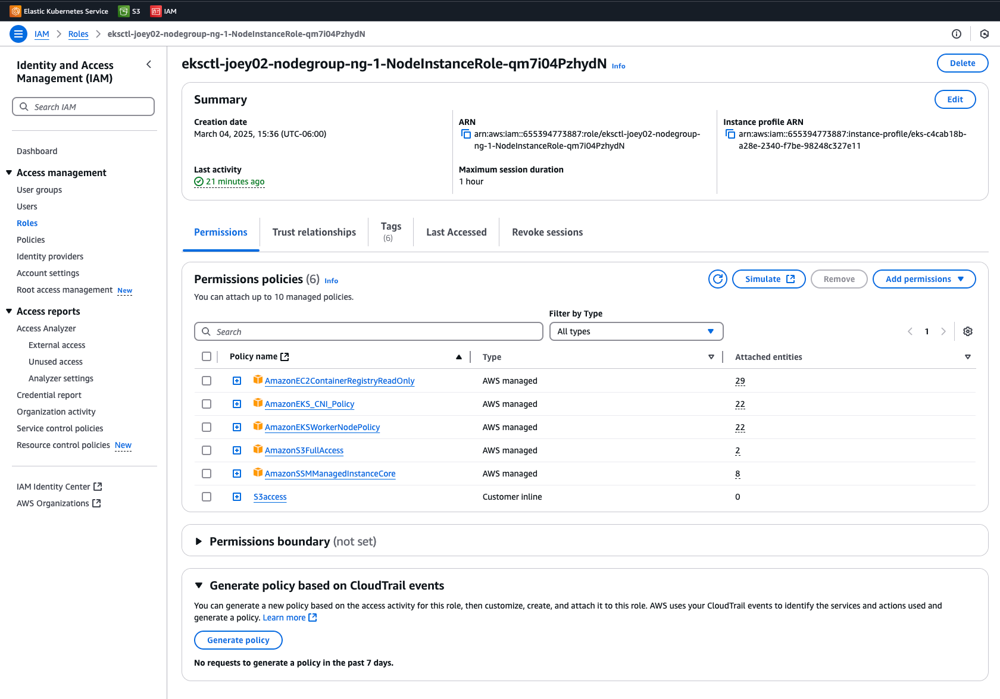
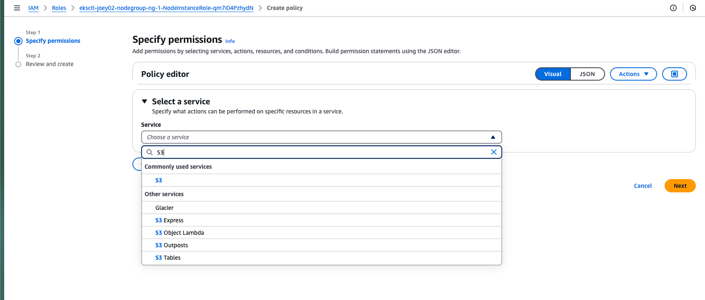
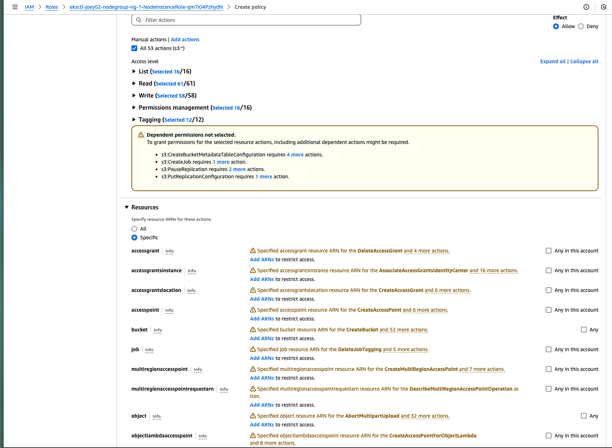

# Connection via IAM Policy

To grant S3 permissions to an IAM role, follow these steps:

Navigate to IAM Roles
Go to the IAM service in the AWS console.

Click on Roles to manage existing roles.

Use the search bar to locate an existing IAM role to which you want to add S3 permissions.

On the right-hand side, navigate to:

"Add permission" → "Create inline policy" (to create a new policy).

"Attach policies" (to attach an existing policy).

# Configure the incline Policy
### Step 1: Select a Service

From the Services dropdown, choose a service to apply permissions to.

### Step 2: Choose S3
Select S3 as the target service.

### Step 3: Define Actions and Resources
Choose the specific S3 actions and resources that the policy should allow access to.

### Step 4: Review and Create
Review the policy settings and click Create to finalize the configuration.

