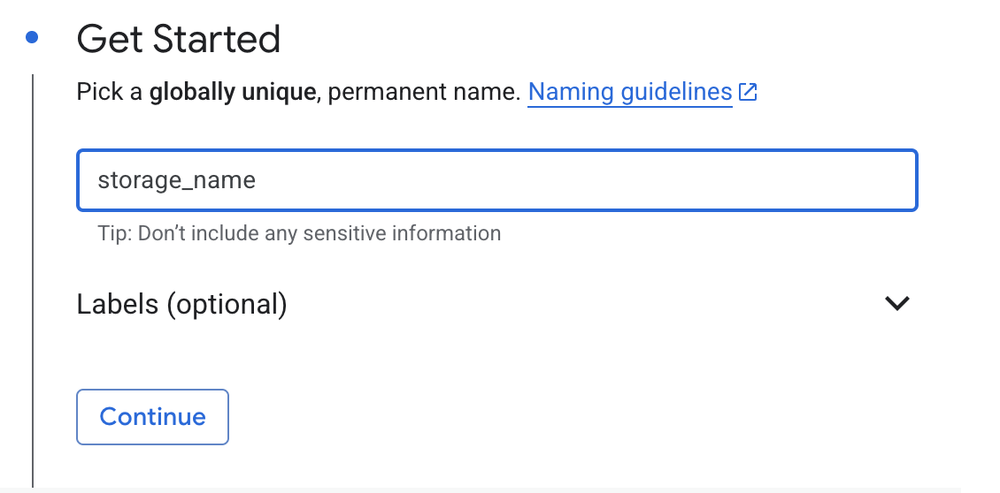
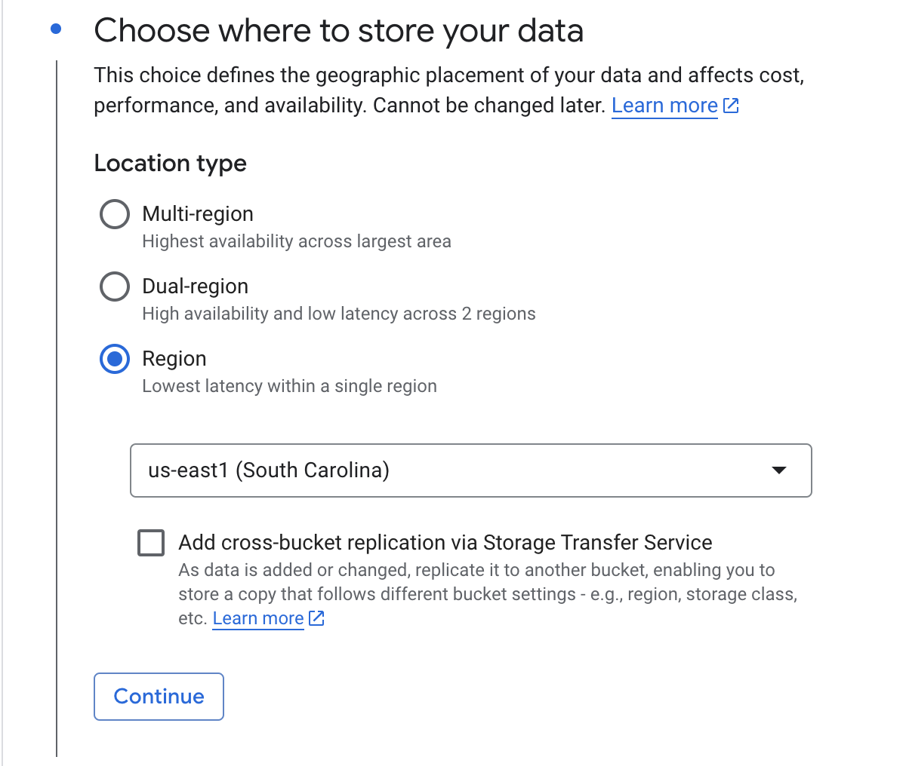
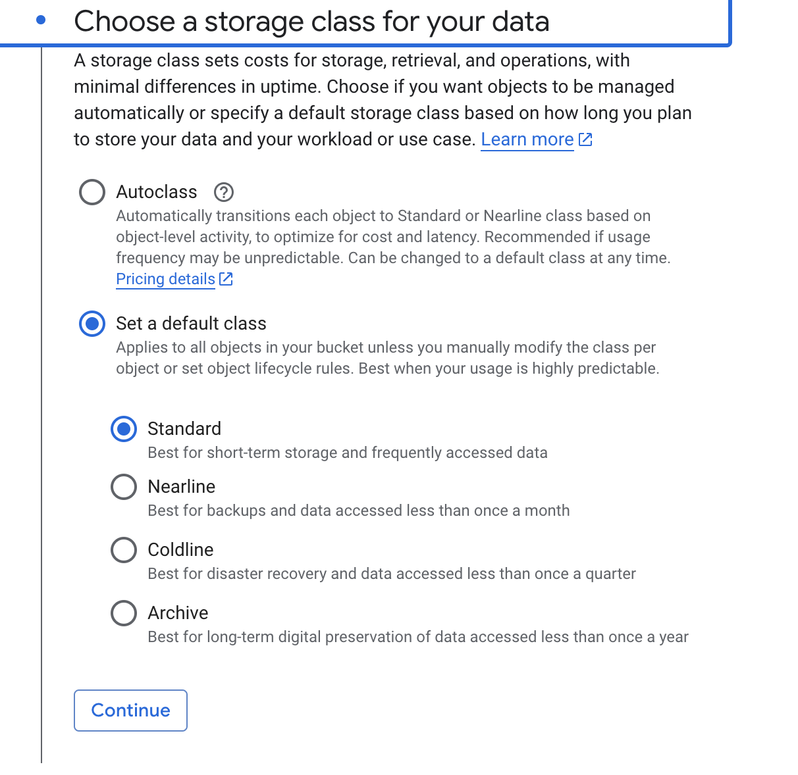
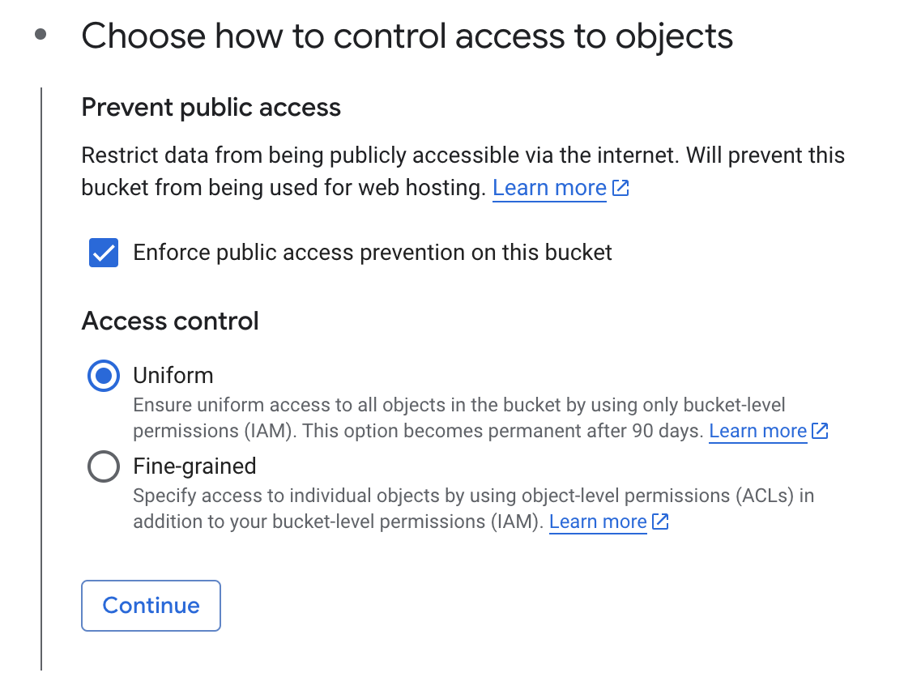
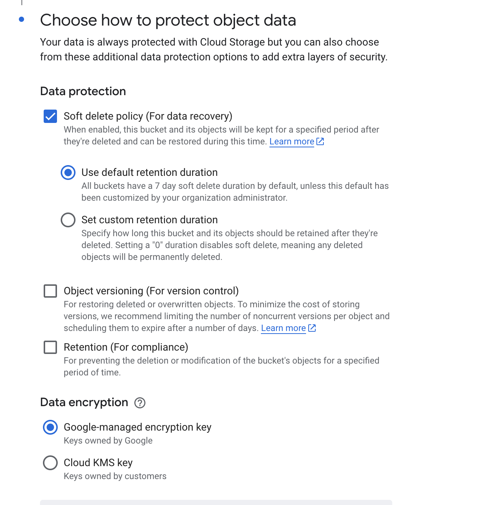

# Pre requisite

Login to Google Cloud and go to Cloud Storage (This can be searched with the search bar) then follow the next steps.

1. Go to buckets and click on create bucket

2. Choose a name and leave the rest of the configurations as default

3. Choose Region as location type and your location.

4. Choose the default storage class

4. Choose the default access control

5. Choose the default object data protection

6. Click on create and confirm
