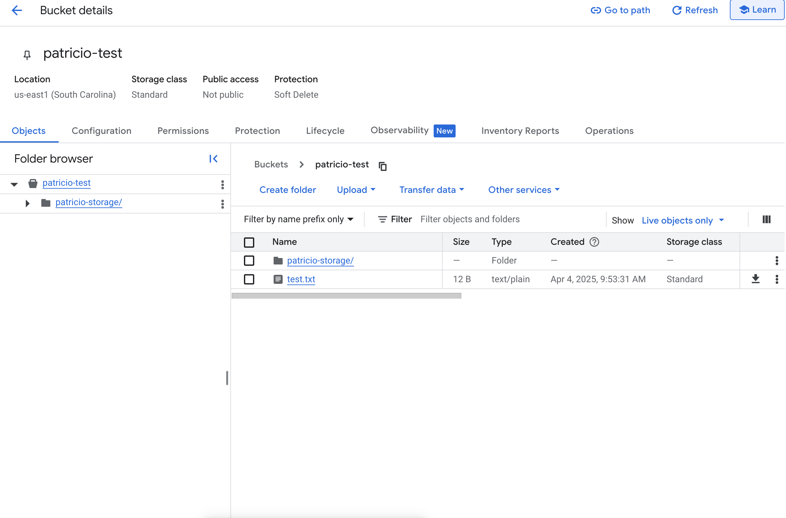
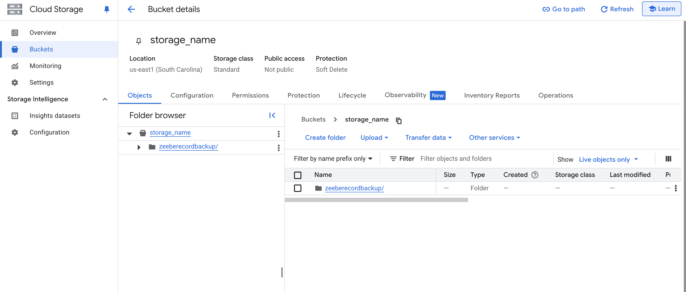

# Helm setup and backup test


Now that you have storage, service account and key the next step is to configure your helm values and run your backup. So far this backup guide is only for Zeebe. Operate/Tasklist/Optimize are still pending.


# 1. Zeebe
## Configuration

1.1 In your custom Helm values, in the Zeebe section, add this information
```yaml
zeebe:
  env:
    - name: ZEEBE_BROKER_DATA_BACKUP_GCS_BUCKETNAME
      value: "storage_name"
    - name: ZEEBE_BROKER_DATA_BACKUP_GCS_BASEPATH
      value: "some_directory_name"
    - name: ZEEBE_BROKER_DATA_BACKUP_STORE
      value: "GCS"
    - name: GOOGLE_APPLICATION_CREDENTIALS
      value: /var/secrets/gcp/key.json

  extraVolumes:
    - name: gcp-credentials
      secret:
        secretName: gcp-credentials

  extraVolumeMounts:
    - name: gcp-credentials
      mountPath: /var/secrets/gcp
      readOnly: true
````      

> Note: the access key is created in the connection document


The google `basepath` is the container name. Zeebe will create snapshots on that repository. It is not possible to give a path to the value, and the data will be stored at the root level.

1.2

Create a Kubernetes secret that will be used by Camunda (make sure its in the same namespace as Camunda Platform). The secret will be created using the JSON file that was dowloaded from GCP.

```shell
kubectl create secret generic gcp-credentials --from-literal "key.json=$(cat some-json1231423.json)"
```
1.3 Restart the cluster

Run the command
```shell
helm upgrade --namespace camunda camunda camunda/camunda-platform --version <helm version> -f <MyValue.yaml> 
```
# 2. Operate/Tasklist/Optimize/Zeebe Elasticsearch

2.1 Create the configuration for ElasticSearch

The configuration is

> Attention: Bitnami helm chart change and the impact in 11.2.2 and after
>

From 11.2.2 and after

```yaml
elasticsearch:
  initScripts:
    init-keystore.sh: |
      #!/bin/bash
      set -e
      echo "Adding GCS credentials to Elasticsearch keystore..."
      elasticsearch-keystore add-file gcs.client.default.credentials_file /var/secrets/gcp/key.json

  extraConfig:
    gcs.client.default.project_id: "your-project-id"

  extraVolumes:
    - name: gcp-credentials
      secret:
        secretName: gcp-credentials

  extraVolumeMounts:
    - name: gcp-credentials
      mountPath: /var/secrets/gcp
      readOnly: true
```      
Before 11.2.2 (until 11.2.1):


```yaml
elasticsearch:
  initScripts:
    init-keystore.sh: |
      #!/bin/bash
      set -e
      echo "Adding GCS credentials to Elasticsearch keystore..."
      elasticsearch-keystore add-file gcs.client.default.credentials_file /var/secrets/gcp/key.json

  extraConfig:
    gcs.client.default.project_id: "your-project-id"

  extraVolumes:
    - name: gcp-credentials
      secret:
        secretName: gcp-credentials

  extraVolumeMounts:
    - name: gcp-credentials
      mountPath: /var/secrets/gcp
      readOnly: true
```      


By doing that, you connect Elastic search to Azure.

2.2 Reference a repository for **Operate**, **Tasklist**, and **Optimize**
```yaml
operate:
  enabled: true
  env:
    - name: CAMUNDA_OPERATE_BACKUP_REPOSITORY_NAME
      value: "operaterepository"
tasklist:
  enabled: true
  env:
    - name: CAMUNDA_TASKLIST_BACKUP_REPOSITORY_NAME
      value: "tasklistrepository"
optimize:
  enabled: true
  env:
    - name: CAMUNDA_OPTIMIZE_BACKUP_REPOSITORY_NAME
      value: "optimizerepository"
```

2.3 Restart the cluster.

Run the command
```shell
helm upgrade --namespace camunda camunda camunda/camunda-platform -f <MyValue.yaml>
```


2.4 Create Zeebe repository in Elasticsearch


Access Elasticsearch, via a `port-forward` for example

```shell
kubectl port-forward svc/camunda-elasticsearch 9200:9200 -n camunda
```

2.5 Create a repository `zeeberecordrepository` and register the Azure container. it's possible to register a `base_path`, to save the content in a subfolder on the container

```shell
curl -X PUT "http://localhost:9200/_snapshot/zeeberecordrepository" \
  -H "Content-Type: application/json" \
  -d '{
    "type": "gcs",
    "settings": {
      "bucket": "storage_name",
      "client": "default",
      "base_path": "zeeberecordbackup"
    }
  }'
```


2.6 Create a repository `operaterepository`
```shell
curl -X PUT "http://localhost:9200/_snapshot/operaterepository" -H "Content-Type: application/json" \
-d '{
  "type": "gcs",
  "settings": {
    "bucket": "storage_name",
    "client": "default",
    "base_path": "operatebackup"
  }
}'
```

2.7 Create a repository `tasklistrepository`

```shell
curl -X PUT "http://localhost:9200/_snapshot/tasklistrepository" -H "Content-Type: application/json" \
-d '{
  "type": "gcs",
  "settings": {
    "bucket": "storage_name",
    "client": "default",
    "base_path": "tasklistbackup"
  }
}'
```

2.8 Create a repository `optimizerepository`

```shell
curl -X PUT "http://localhost:9200/_snapshot/optimizerepository" -H "Content-Type: application/json" \
-d '{
  "type": "gcs",
  "settings": {
    "bucket": "storage_name",
    "client": "default",
    "base_path": "optimizebackup"
  }
}'
```

2.9 Check creation

Get all repositories, to verify the creation

```shell
curl -X GET "http://localhost:9200/_snapshot/_all?pretty"
```


## 3 Test 

Run a backup on components as specified here https://docs.camunda.io/docs/8.6/self-managed/operational-guides/backup-restore/backup/

Note that the following ports might have changed between versions. Please verify. The following applies to helm version 11.2.2

2.10 Forward all necessary services with their respective ports. 
```shell
Zeebe Gateway
kubectl port-forward svc/camunda-zeebe-gateway 9600:9600 -n camunda
```

```shell
Optimize
kubectl port-forward services/camunda-optimize 9620:8092 -n camunda
```
```shell
Tasklist
kubectl port-forward services/camunda-tasklist 9640:9600 -n camunda
```

```shell
Operate
kubectl port-forward services/camunda-operate 9600:9600 -n camunda
```

TO BE CONTINUED


2.2 Pause the exporting

```shell
curl -X POST "http://localhost:9600/actuator/exporting/pause"   -H 'Content-Type: application/json'    -d '{}'
```

2.3 Execute a backup

```shell
curl -X POST "http://localhost:9600/actuator/backups"  -H 'Content-Type: application/json'  -d "{\"backupId\": \"8\"}"
```
2.4 Monitor the backup
```shell
curl -s "http://localhost:9600/actuator/backups/8"
```

2.5 Resume Zeebe

```shell
curl -X POST "http://localhost:9600/actuator/exporting/resume"  -H 'Content-Type: application/json'    -d '{}'
```


2.6 Check the container

Some files must be visible on the storage



Under folder 1, a folder 8 is visible (8 is the backup ID)


##	Test the zeebe Record backup
2.10 Run a backup on Zeebe Record

** Backup **

```shell
curl -X PUT http://localhost:9200/_snapshot/zeeberecordrepository/backup_1 -H 'Content-Type: application/json'   \
-d '{ "indices": "zeebe-record*", "feature_states": ["none"]}'
```

An answer {“accepted”:true}, and a folder is created on the container




** Restore**

2.11 Check the existence of all zeebe-record indexes

```shell
curl -X GET http://localhost:9200/_cat/indices/zeebe-record*?v
```

2.12 Delete all indices

```shell
curl -X DELETE http://localhost:9200/zeebe-record*?
```

> ***Note***: the deletion may need to delete index per index

2.13 Restore

```shell
curl -X POST http://localhost:9200/_snapshot/zeeberecordrepository/backup_1/_restore -H "Content-Type: application/json" -d '{ "indices": "*", "ignore_unavailable": true, "include_global_state": true }'
```

## Test the backup on Operate

This backup is run on Operate. Operate will contact Elasticsearch to run the backup.

2.14 Port forward the port number 9600 on operate

```shell
kubectl port-forward svc/camunda-operate 9600:9600 -n camunda
```

> **Note** on 8.5, the port to run the backup is 80, not 9600.


2.15 Backup Operate

Run the backup

```shell
curl -X POST http://localhost:9600/actuator/backups -H 'Content-Type: application/json' -d '{ "backupId": 6}'
```

2.16 Check the container


Get all snapshot on the repository

```shell
curl -X GET "http://localhost:9200/_snapshot/operaterepository/_all?pretty"
```
