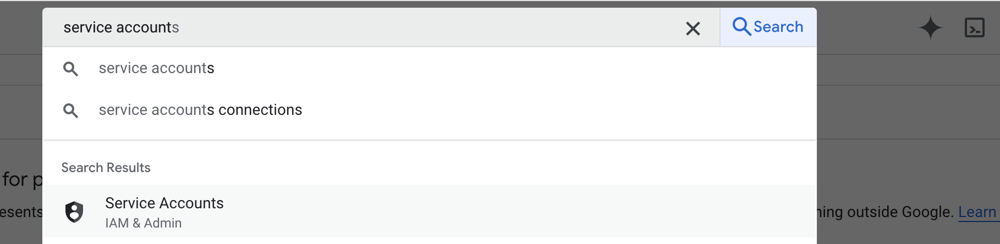
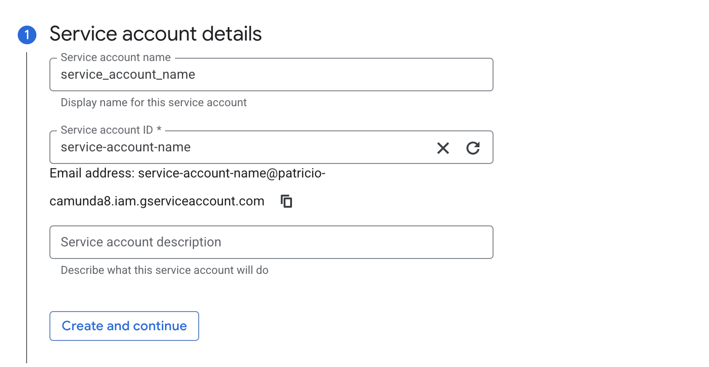
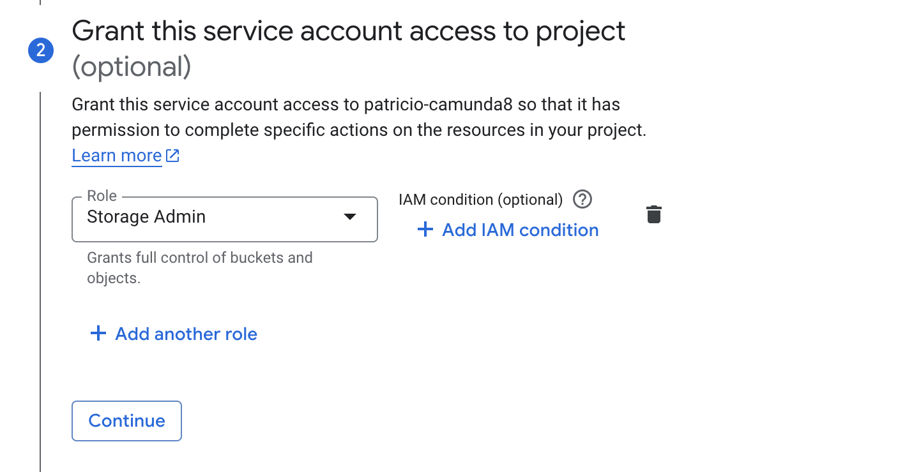
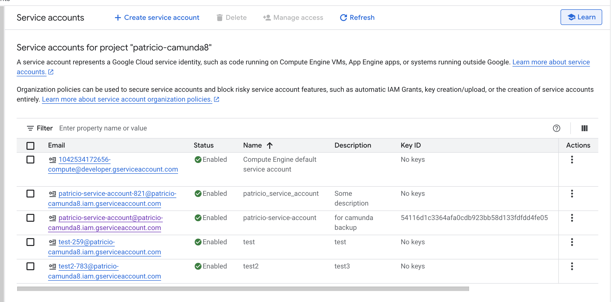

# Connection

It is required to have a service account in order to have your cluster and Camunda 8 components connect to the Google storage bucket. Follow the next steps to create a service account and download the key.

1. Connect to Google Cloud Console and go to Service Accounts IAM&Admin

2. Click create service account

3. Fill out the service account name with your preference and add a description

4. Add the storage admin role (or the specific role that you might need to create/delete objects in a bucket) to the service account as per the below

5. Click Done

6. Go to the view that shows all of the service accounts and click on your recently created service account.

7. Go to the Keys tab

8. Click on add new key --> create new key and select JSON.  Download the key and store it in a safe place. This is the key that Camunda will use to gain access to your storage bucket via such service account.

