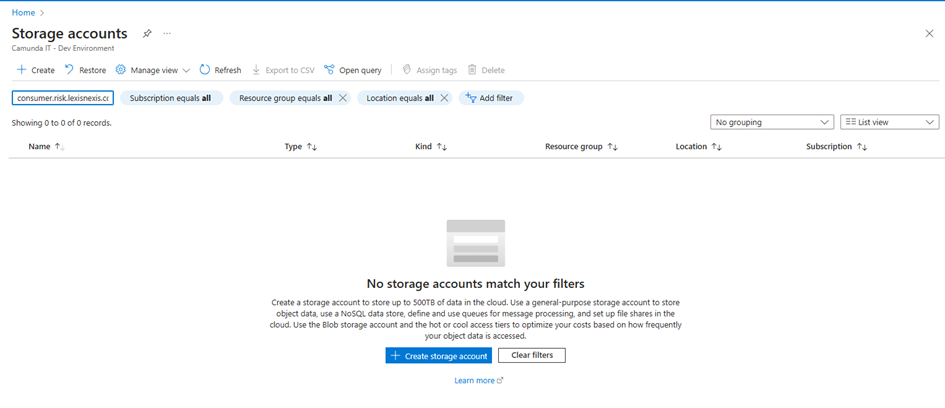

# Pre requisite

Connect to Azure and go to Storage Account


Create a storage account



Give a name like `pierreyvesstorageaccount`, choose a resource Group and select the appropriate cost Redundancy


Access the key on the left menu, section `Security + networking`, section `access keys`


Get the storage account connection string via the command line
```shell


az storage account show-connection-string --name pierreyvesstorageaccount --resource-group DefaultResourceGroup-EUS
pierre-yves [ ~ ]$ az storage account show-connection-string --name pierreyvesstorageaccount --resource-group DefaultResourceGroup-EUS
{
"connectionString": "DefaultEndpointsProtocol=https;EndpointSuffix=core.windows.net;AccountName=pierreyvesstorageaccount;AccountKey=…..Iw==;BlobEndpoint=https://pierreyvesstorageaccount.blob.core.windows.net/;FileEndpoint=https://pierreyvesstorageaccount.file.core.windows.net/;QueueEndpoint=https://pierreyvesstorageaccount.queue.core.windows.net/;TableEndpoint=https://pierreyvesstorageaccount.table.core.windows.net/"
}
```

Inside this account, you create containers. Let’s create two containers
•	Container `elasticsearchcontainer`
•	Container `zeebecontainer`

The first container will contain all backup from elastic search (Zeebe record, operate, Tasklist, optimize)

> ***Note***: You don’t need to create two containers; this is just to demonstrate the different links to each container. For your information, Zeebe saves snapshots at the root of the container, whereas Elasticsearch can save information in a subfolder in the container.

Vocabulary
* A **container** is like a disk. It contains folders and files
* A **repository** is a name in Elastic Search. A repository references a place to store data: it will reference a container and a base path in that container (for example, /operatebackup)
* A **snapshot** is one execution in the repository, and it save the current information to the repository. A repository contains multiple snapshot.

