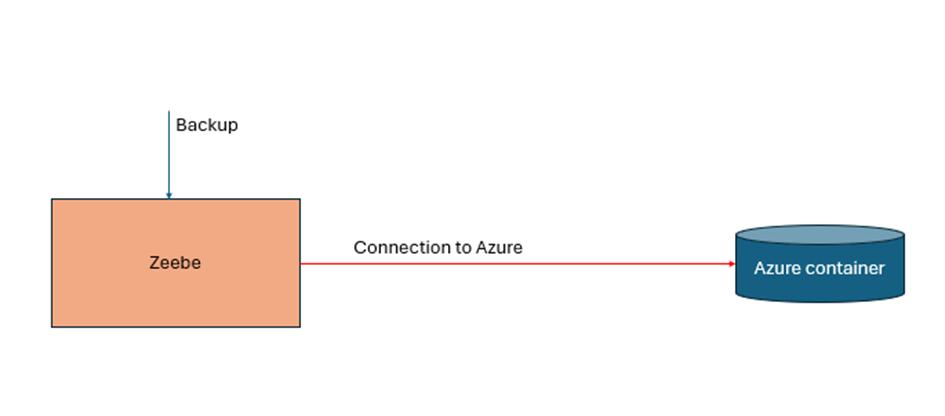

# Azure storage

This documentation is based on 8.6.x version

# Pre requisite

Check the [Prerequisite](AzurePrerequisite.md)

# Principle

Zeebe is connected directly to the Azure container. It will save the backup at the root folder in the container.

Operate, TaskList, Optimize run the backup on Elastic search. They ask Elastic search to back up the correct index on a repository (this repository is a parameter on Operate).
The repository is configured in Elasticsearch, pointing to the container in Azure. This configuration (create the repository) must be done in advance in Elasticsearch

# Connection via an account name / account key

Connect your storage using an [Account Name/ Account Key.md](AzureAccountName.md)

# Connection via an IAM policy

connect your storage using an [IAM Policy](AzureIAMPolicy.md)

